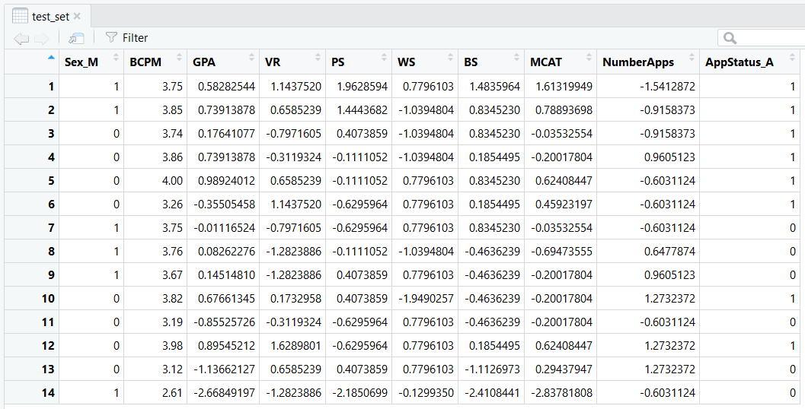
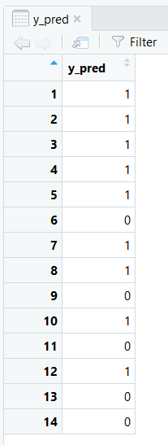

# Med School Acceptance Random Forest Classification
Use data about medical school applicants and acceptances along with Random Forest Classification to classify whether a specified candidate will get accepted or denied from med school.

### Libraries to Install
* mltools
* data.table
* caTools
* randomFOrest

### Interpreting Dataset Columns
* Sex
  - Male or Female
* BCPM
  - GPA of Univeristy Biology, Chemistry, Math and Physics courses taken at undergraduate university
* GPA 
  - Overall GPA at undergraduate university
* PS 
  - Score of personal statement
* MCAT
  - MCAT score (old format)
* NumberApps
  - Total number of applications sent
* AppStatus
  - Accepted or Denied (AppStatus is listed as accepted if canidate was accepted to at least one program)

## Running the tests
* Simply download the data and the program to your machine. When launching the program, make sure that the directory containing the data is set as your working directory.
* Once the working directory is properly configured, run the entire program. The predictions will be saved in a data frame titled 'y_pred'
## Results
#### Test set

#### Predictions

## Final Thoughts
* Results from the classification model are promissing, but no where near the accuracy that would be needed in order to use this model for any type of decision-making.
* 11 of the 14 values were predicted correctly, with 3 of the values being predicted incorrectly. The model had a 79% prediction accuracy.
* Due to the limited amount of data, it is understandable that the model only achieved 79% accuracy. The dataset contained 56 entries in total, and with access to more data, higher accuracy is very achievable.
* Random Forrest Classification has shown great effectiveness with classification probelms in general, and this one should be no exception. With more available data, this model could be used to predict with high accuracy whether or not an individual is likely to get accepted into med school.

## Authors
* **William Schmidt** - [LikedIn](https://www.linkedin.com/in/william-schmidt-152431168/)
